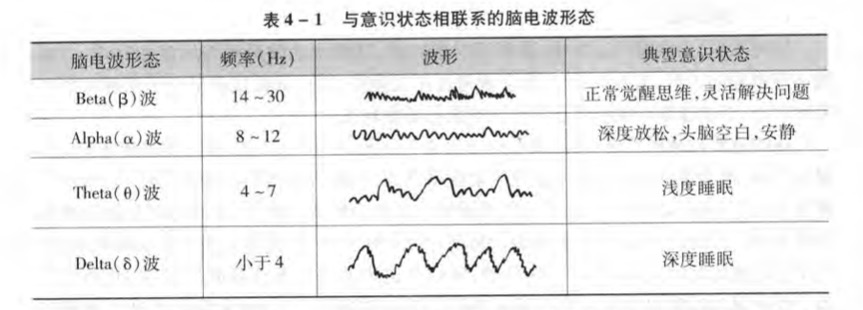
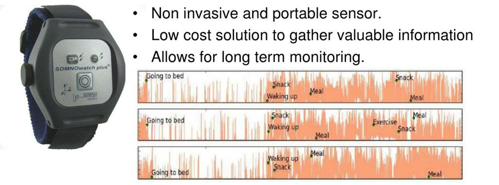
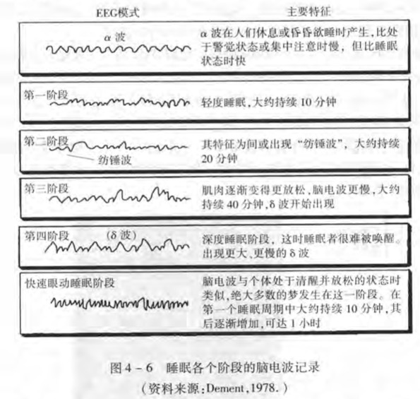
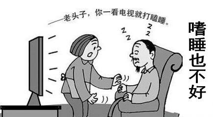
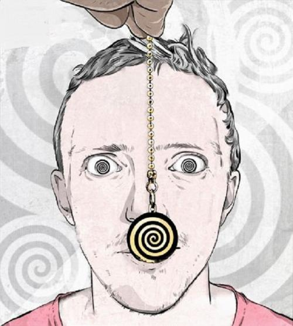

# <h1 style="text-align:top">第三节 -  睡眠与梦

## 何吉波，博士

hejibolaboratory@pku.org.cn
version:2022-09-23

---

# 本节课程框架

- 0. 前情回顾
- 1. 睡眠
- 2. 课程总结
- 3. 延伸阅读与思考

---

# 0. 前情回顾
## 第四章 意识和意识状态
- 第一节    心理的发生和发展
- 第二节    意识
- 第三节    睡眠与梦
- 第四-六节 注意

---
# 睡眠 - 本小节学习难点与重点
- （一）睡眠的分阶段
- （二）快速眼动睡眠（REM）
- （三）睡眠障碍

---
# 睡眠 - 本小节学习思考目标：
-  为什么要研究睡眠？（必要性、难点）
-  睡眠的研究工具和标准
-  睡眠的创新点（新方法、新应用、新问题）
-  Critical thinking/辩证思维

---
# 1.1 为什么要研究睡眠?
- 大约有30%的成年人 自述有失眠经历。
- 在人的一生中，大约有25年时间处于睡眠 这种关意识状态。

---
# 1.1 为什么要研究睡眠?
- 睡眠的基本特征: (1) 普通性  (2) 必需性
- 人类的睡眠一般为每天7-8小时， 正常范围是5-11小时

---
# 1.1 为什么要研究睡眠?
睡眠缺乏会导致：
- 双手颤抖
- 眼睑下垂
- 目光呆滞
- 注意力涣散
- 痛觉敏感
- 全身不适
- 焦虑， 幻觉，妄想

---
# 1.1 为什么要研究睡眠?

---
# 1.2. 睡眠的定义
” 
 睡眠是与觉醒相对的意识状态 ，是指人所具有的一种半意识 状态。 睡眠能够调整和巩固白天记忆的内容。

---
# 1.3. 睡眠的功能和理论 
- 恢复论（restoration theory）/保养论(conservation theory)：
睡眠能恢复人的精力、消除疲劳，促进体力使精神得到恢复，是保证大脑正常工作的生理条件。
- 演化论(evolutionary theory)
不同睡眠方式主要是在生存过程中长期演化而来。动物睡眠的目的是为了避免消耗能量，免受伤害。由于人类缺乏夜视能力，容易受到其他猛禽的威胁，因此必须在晚上选择安全的地方睡眠。

---
# 1.3 睡眠的功能和理论 
” 
睡眠的最初功能是为了使人类避免侵袭，以后逐步演化出恢复体力的功能。 

---
# 1.3 睡眠的生物节律:睡眠的两阶段理论
睡眠和觉醒的生物节律由过程S (process Sleep)和过程C (process Circadian,正弦函数)决定

注：睡眠剥夺导致更多的慢波睡眠（Slow wave sleep, SWA）和更长的总睡眠时长（Total Sleep Time, TST）

---
# 1.4 影响睡眠需求的因素：
- 1. 年龄
- 2. 人格特质
- 3. 工作性质

---
# 1.4 影响睡眠需求的因素：

- 年龄： 随着年龄的增长，所需要的睡眠随之减少。

---
# 1.5 如何研究睡眠？
- 多导睡眠图（Polysomnography,PSG），主要用于睡眠、梦境、抑郁症、睡眠呼吸暂停综合征。

---
# 1.5 如何研究睡眠？
睡眠时以δ波(delta)为主，以及θ波(theta)

---
# 1.5 如何研究睡眠？
- 体动仪:以惯性测量单元(IMU)和光线传感器记录运动和睡眠行为

---
# 1.5 如何研究睡眠？
## 体动仪（Actigraphy)可以测量如下数据:
- Total Sleep Time（TST）/总睡眠时长 ：
   大于6-7小时 (Svensson, Saito, Svensson et al., 2021)
- Wake After Sleep Onset(WASO)/睡后觉醒时长：
  小于总睡眠时长的10%，或者42分钟。

---
# 1.5 如何研究睡眠？
- 精神运动警觉任务（Psychomotor Vigilance Task, PVT）

---
# 1.6 睡眠的阶段 (重点)
2013年以前，睡眠被分为五个阶段。 

---
# 1.6 睡眠的阶段 (重点)
2013年后，睡眠分为四个阶段。（五类分法的N3和N4合并） 

---
# 1.6 睡眠的阶段 (重点)
- I.  第一阶段(N1)，轻度睡眠：
    心率减慢，呼吸不规则，肌肉放松，以alpha 波为主

---
# 1.6 睡眠的阶段 (重点)
- II. 第二阶段（N2），浅度睡眠
     纺锤波(sleep spindle)和K-complex标志着睡眠的到来。 

---
# 1.6 睡眠的阶段 (重点)
- II. 第二阶段（N2），浅度睡眠
  以theta波为主

---
# 1.6 睡眠的阶段 (重点)
- III. 第三阶段（N3），睡眠加深,  delta慢波出现 ，也称为慢波睡眠

---
# 1.6 睡眠的阶段 (重点)
- IV. 第四阶段（REM）,快速眼动睡眠，深度睡眠,以Sawtooth波为特征
Sawtooth waves (Loomis,1937) maximize in the central regions, & typically occur in repetitive bursts and in the vicinity of eye movements.

---
# (二)睡眠的状态 
- 快速眼动睡眠
- 快波睡眠
- 慢波睡眠

---
# 2.1 快速眼动睡眠
快速眼动睡眠(Rapid Eye Movement, REM),也称为梦境睡眠或者快波睡眠。在这个阶段中眼球会快速的向各个方向移动，同时身体的肌肉会放松，呈现一种临时性瘫痪的状态。呼吸变快、变浅，呼吸不规律，心率加快，血压升高，REM是在全部睡眠阶段中最深的，总共有大约90-120分钟的时间，每次大约20-30分钟。梦境发生在REM睡眠的。另外REM睡眠对记忆的储存、整理、整合都非常的重要。
- 前三个阶段也合称非快速眼动睡眠（nREM）

---
# 2.1  快速眼动睡眠

---
# 2.1  快波睡眠& 慢波睡眠
## - 快波睡眠 (fast-wave sleep)
- 眼动速率为每分钟50-60次， 脑电节律在8-12Hz。
- During wakefulness and REM, beta and gamma from 10-15 to 80-120Hz (Corsi-Cabrera et al., 2001; Brown et al.,2012)
- 与心理创伤的恢复、神经发育有着密切的联系。

---
# 2.1  快波睡眠& 慢波睡眠
## - 慢波睡眠 （Slow Wave Sleep, delta睡眠）
- 慢波睡眠的脑电节律通常低于每秒12次。
- <a href="https://onlinelibrary.wiley.com/doi/abs/10.1111/j.1365-2869.2012.01017.x#:~:text=sigma%20range%20%2812%E2%80%9316%20Hz%29%2C%20and%20EEG%20slow-wave%20activity,3.5%20Hz%29%2C%20might%20represent%20oscillatory%20activity%20that%20promotes">EEG slow-wave activity (SWA), highly-synchronized oscillations during NREM sleep (0.1– 3.5 Hz) (Holz, Piosczyk,Feige, et al.,2012)</a>
- <a href="https://www.baidu.com/s?ie=utf-8&f=8&rsv_bp=1&rsv_idx=1&tn=baidu&wd=-%20%E5%9C%A8%E7%9D%A1%E7%9C%A0%E7%9A%84%E5%89%8D%E4%B8%89%E5%88%86%E4%B9%8B%E4%B8%80%E6%97%B6%E9%97%B4%EF%BC%8C%E7%9A%86%E4%B8%BA%E6%85%A2%E6%B3%A2%E7%9D%A1%E7%9C%A0%E3%80%82&fenlei=256&rsv_pq=0xe614a05600073cc4&rsv_t=2bfeVEvGZh0CIxkwN6KBJQyQJVgMylIkQn%2BK%2BPxKzi3FS9Awxwdy8%2BH1ZYs8&rqlang=en&rsv_enter=1&rsv_dl=ib&rsv_sug2=0&rsv_btype=i&inputT=4&rsv_sug4=4">在睡眠的前三分之一时间，皆为慢波睡眠。</a>
- 与恢复体力、机体生长关系密切。

---
# (三)睡眠障碍的类型
1. 失眠
2. 嗜睡症
3. 睡眠窒息

---
# 3.1  失眠
- 失眠表现为难以入睡、容易惊醒、时睡时醒、难以沉睡等。
- 失眠者在睡眠时出现更多的alpha波
- 老年人和女性更容易失眠

---
# 3.1 失眠的类型 （按行为表现分类）
- 起始性失眠： 难以入睡
- 维持性失眠： 表现为夜间经常醒来。 （wake after sleep onset, WASO）
- 终止性失眠： 表现为凌晨醒来后无法再次入睡

---
# 3.1 失眠的类型 （按成因分类）
- 情绪性失眠，暂时性失眠，主要是因为情绪、压力或者特殊时间导致的。
- 假性失眠
- 失律性失眠： 由生活节律导致失眠，如时差或者连续加班。
- 药物性失眠：安眠药、咖啡、浓茶、可乐等兴奋性物质。 

---
# 3.1 如何应对失眠？
- 建立信心
- 睡前放松心情
- 规律的生活

- 设计安静的卧房（建议：夜间声音小于30-35dB分贝）
- 使睡床单纯化  （建议：睡前不玩手机）

- 保持适度运动，避免睡前剧烈运动
- 睡前饮食适度  （建议：下午5pm后不喝咖啡）
- 睡前不要饮酒， 喝酒并不能提高睡眠质量
- 忌服安眠药

---
# 3.2 睡眠障碍的类型： 嗜睡症
- 部分判断标准：<a href="https://www.xinglinpukang.com/vod/62976277.html">比以前的睡眠时间多1-2小时</a>
- 在觉醒时，会突然地不可抵抗地想睡觉，并快熟进入快速眼动睡眠阶段。
- 具有遗传性
- 发病年龄大多数为10-12岁，- 发病概率0.2%至1%之间

---
# 3.3 睡眠障碍的类型： 睡眠窒息(Sleep Apnea Syndrome)
- 夜间睡眠7小时内,发生至少持续10秒钟的呼吸窘迫在30次以上,称为睡眠窒息综合征.(Sleep Apnea Syndrome,SAS)<a href="https://xueshu.baidu.com/usercenter/paper/show?paperid=1a1h0850fj2t0cp0ns6c0mr0te684121">(李鸿仁 & 陆铸今, 1994)</a>
- 睡眠窒息表现为打鼾、甚至因为呼吸道阻塞缺氧而出现呼吸停止
- 梦魇、梦游、梦呓、梦惊、遗尿
- 与肥胖有关，并会引起高血压、心脏病、中风，甚至死亡。

---
# 本节核心知识小结
- 睡眠的脑电波PSG：theta, delta波
- 睡眠的四个阶段：N1, N2, N3/慢波睡眠，快速眼动睡眠(REM)
- 快波睡眠，慢波睡眠
- 失眠，嗜睡症，睡眠窒息

---
# 2.1 本节核心知识小结

---
# 5. 延伸阅读与思考：a. 协会 与 会议
- National Sleep Foundation
- American Academy of Sleep Medicine (AASM)
- <a href="http://www.zgsmyjh.org/">中国睡眠研究会</a>

---

# 5. 延伸阅读与思考：b.相关期刊
- Sleep Medicine Reviews (Q1, IF = 11.609)
- Sleep (Q1, IF=5.849)
- Nature and Science of Sleep (Q1, IF = 5.346)
- Sleep Health (Q2, IF = 4.45)
- Journal of Clinical Sleep Medicine (Q2,IF = 4.062)
- Journal of Sleep Research(Q2,IF = 3.981)
- Sleep Medicine (Q2, IF= 3.492)

---
# 5. 延伸阅读与思考：c. 导师资源

链接：https://xueshu.baidu.com/usercenter/index/kaiti#/analysis?keyword=%E7%9D%A1%E7%9C%A0%3B%E5%BF%AB%E9%80%9F%E7%9C%BC%E5%8A%A8%E7%9D%A1%E7%9C%A0

---
# 5. 延伸阅读与思考：d. 睡眠相关问题研究想法
### 睡眠的创新思考维度/Critical thinking：
1. 新表现，或者新脑电特征？
2. Spindle, K-complex, Sawtooth, slow waves的作用和机制？
3. 新技术带来的睡眠的新测量方式？手表检测睡眠可否？
4. 新应用？
5. 跨专业，构建新连接
6. 新问题？一周工作4天？疫情

---
# 5. 延伸阅读与思考：d. 睡眠相关问题研究想法
1. 睡眠的基因问题？
2. 睡眠的生物节律类型应该是2种，还是4种？
3. 基于智能手机的新的睡眠障碍检测方法
4. 民航疲劳合规性？
5. 宇航员的睡眠与疲劳
6. 英国一周工作4天的睡眠情况
7. 疫情隔离期间的睡眠问题

---
# 6. 参考文献:
[1]李鸿仁, & 陆铸今. (1994). 睡眠窒息综合征(附3例临床分析). 小儿急救医学, 1(3), 4.
[2]Svensson, T., Saito, E., Svensson, A. K., Melander, O., Orho-Melander, M., Mimura, M., ... & Inoue, M. (2021). Association of sleep duration with all-and major-cause mortality among adults in Japan, China, Singapore, and Korea. JAMA network open, 4(9), e2122837-e2122837.
[3]Holz, J., Piosczyk, H., Feige, B., Spiegelhalder, K., Baglioni, C., Riemann, D., & Nissen, C. (2012). EEG sigma and slow‐wave activity during NREM sleep correlate with overnight declarative and procedural memory consolidation. Journal of sleep research, 21(6), 612-619.

---
# 下节课？ 第2和3小节. 梦与催眠

---

